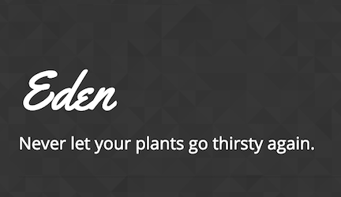

# Eden
Eden is a full-stack garden-management application enabling users to more efficiently care for all of their plants, whether their plot spans acres or a windowsill in their apartment. Users can access the database to add plants to their digital garden, obtain in-depth knowledge on a massive variety of plant species, and create care schedules for the plants in their garden.

The application is built on a Node.js/Express platform and uses Sequelize to power it's MySQL database. Passport.js and bCrypt-js are employed to handle user-authentication and secure sensitive data. Cheerio.js and Axios work in conjunction to scrape plant species data from https://garden.org and store it to the database. Eden uses MVC design principles and Handlebars.js as a view engine and templating framework.

## Deployed Application
https://powerful-lowlands-42478.herokuapp.com/

### Technologies and Dependencies
- Node.js - https://nodejs.org/en/
- Express.js - https://expressjs.com/
- MySQL - https://www.mysql.com/
- Sequelize - http://docs.sequelizejs.com/
- Passport.js - http://www.passportjs.org/
- bCrypt - https://www.npmjs.com/package/bcrypt-nodejs
- Cheerio.js - https://cheerio.js.org/
- Axios - https://www.npmjs.com/package/axios
- Handlebars - http://handlebarsjs.com/

### DEVELOPERS
- Daniel Lois | https://github.com/funkedee
- Taylor Zlomke | https://github.com/tzlomke 
- Yeshu Gaire | https://github.com/yeshugaire
